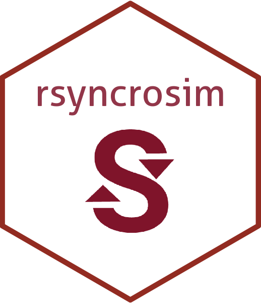

<!-- README.md is generated from README.Rmd. Please edit that file -->

# rsyncrosim 

## The R interface to SyncroSim

<!--  -->

## About SyncroSim

<a href="https://syncrosim.com/" target="_blank">**SyncroSim**</a> is an
open science tool for organizing tabular and spatial data, running
geospatial simulation code, and visualizing model results. Its flexible
framework supports the integration of code across multiple scripting
languages and the use and creation of customizable **SyncroSim**
<a href="https://docs.syncrosim.com/how_to_guides/package_overview.html" target="_blank">packages</a>,
allowing you to tailor the platform to your specific needs.

For more details, please consult the **SyncroSim**
<a href="https://docs.syncrosim.com/" target="_blank">online
documentation</a>.

## About `rsyncrosim`

**rsyncrosim** is an open-source R package that leverages the
**SyncroSim** command-line interface to simplify scripting model
workflows for **SyncroSim** in R. This R package provides functions for
building models from scratch, running those models, and accessing both
spatial and tabular model outputs. The **rsyncrosim** package is
designed to work with any **SyncroSim** package.

A key feature of the **rsyncrosim** package is its seamless integration
with <a href="https://syncrosim.com/studio/" target="_blank">**SyncroSim
Studio**</a>, allowing you to interactively explore and validate your
models in the user interface as you step through your R code.
Additionally, **rsyncrosim** facilitates the creation of a permanent,
reproducible record of the entire modeling workflow – including pre- and
post-processing of model inputs and outputs – in an R script.

### Installation

- [Download](https://cran.r-project.org/package=rsyncrosim/) from CRAN

- [Download](https://syncrosim.github.io/rsyncrosim/articles/a06_rsyncrosim_install_github.html)
  from GitHub

### Getting Started

- Run the vignettes:

  - [Introduction to
    `rsyncrosim`](https://syncrosim.github.io/rsyncrosim/articles/a01_rsyncrosim_vignette_basic.html)

  - [`rsyncrosim`: introduction to
    uncertainty](https://syncrosim.github.io/rsyncrosim/articles/a02_rsyncrosim_vignette_uncertainty.html)

  - [`rsyncrosim`: introduction to
    pipelines](https://syncrosim.github.io/rsyncrosim/articles/a03_rsyncrosim_vignette_pipelines.html)

  - [`rsyncrosim`: introduction to spatial
    data](https://syncrosim.github.io/rsyncrosim/articles/a04_rsyncrosim_vignette_spatial.html)

  - [Introduction to `ST-Sim` in
    `rsyncrosim`](https://syncrosim.github.io/rsyncrosim/articles/a05_rsyncrosim_stsim_vignette.html)

- View the package
  [documentation](https://cran.r-project.org/package=rsyncrosim/rsyncrosim.pdf)
